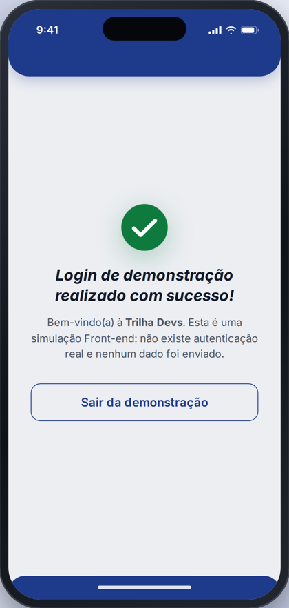

# Trilha Devs — Login

Tela de login da **Trilha Devs**, criada originalmente por mim no **Figma** como protótipo mobile e depois reconstruída como interface Front-end funcional com **HTML5, CSS3 e JavaScript puro**.

🔗 **Demonstração online:** https://ruangdev0-ux.github.io/trilha-devs-login/

## Teste você mesmo

A demonstração tem um **acesso de teste** que aparece na própria tela:

| Campo | Valor |
| --- | --- |
| E-mail | `demo@trilhadevs.com` |
| Senha | `123456` |

Você também pode clicar em **Preencher dados** para completar os dois campos automaticamente e depois clicar em **Entrar**.

> 🔒 **Autenticação simulada.** O login é uma simulação feita apenas no Front-end, para demonstrar a interface e o fluxo. Não existe Back-end, banco de dados nem autenticação real. As credenciais acima são públicas e nenhum dado digitado é enviado ou armazenado.

<p align="center">
  
  &nbsp;
  
  &nbsp;
  
</p>

---

## Sobre o projeto

A **Trilha Devs** é a tela de login de um app pensado para estudantes de programação. Eu desenhei a interface durante o **primeiro semestre do curso de Análise e Desenvolvimento de Sistemas (ADS)**, em atividades sobre **UI/UX, design de interfaces e prototipagem**.

O protótipo original foi feito no Figma, em um frame mobile (iPhone, 402 × 844 px), com:

- cabeçalho e rodapé azuis;
- ícone `</>` como logo;
- título "Faça Login";
- campos de e-mail e senha;
- botão "Entrar";
- links "Criar conta" e "Esqueceu sua senha".

## Objetivo

Levar o protótipo do Figma para código, reconstruindo a tela com HTML, CSS e JavaScript em vez de exportar uma imagem, sem perder a identidade visual original.

Aproveitei a implementação para ajustar alguns pontos em relação ao protótipo:

- espaçamentos e alinhamentos;
- acessibilidade;
- responsividade;
- validação e feedback visual nos campos.

Numa segunda versão, a interface ganhou acabamento de aplicativo mobile:

- apresentação dentro de um smartphone no tablet e no desktop;
- campos, botão e cantos mais refinados;
- acesso de demonstração;
- login simulado com tela de sucesso;
- notificações discretas (*toast*) no lugar de uma caixa de mensagem fixa.

## Do Figma para o Front-end

| No protótipo (Figma) | Na implementação |
| --- | --- |
| Frame mobile de 402 × 844 px | Tela cheia no celular e smartphone centralizado (moldura, barra de status e Dynamic Island) a partir de 600 px de largura |
| Cores `#1E3A8A`, `#0D37A3`, `#D9D9D9` e `#111827` | Mesma paleta, definida como variáveis CSS (*design tokens*). O cinza de fundo ficou um pouco mais claro para melhorar o contraste |
| Cabeçalho e rodapé azuis | Mantidos, com cantos arredondados, sombra suave e indicador de início |
| Tipografia Inter (Semi Bold Italic, Medium, Bold Italic, Light Italic) | Inter via Google Fonts, com os mesmos pesos e estilos |
| Logo `</>` em um retângulo azul | Logo feita em HTML e CSS, sem usar imagem, com cantos arredondados e sobreposta ao cabeçalho |
| Campos cinza com texto de exemplo | Inputs reais com ícone, `placeholder` em itálico, foco visível e estados de erro e sucesso |
| Botão "Entrar" | Botão arredondado com sombra, estado de carregamento e login simulado |
| "Criar conta" e "Esqueceu sua senha" | Mantidos como funcionalidades demonstrativas, com notificações explicativas |

## Tecnologias

- **HTML5**: estrutura semântica (`main`, `section`, `form`, `label`)
- **CSS3**: variáveis CSS, Flexbox, Grid, media queries, `env(safe-area-inset-*)` e animações
- **JavaScript (ES6+)**: validação e interações, sem frameworks nem bibliotecas
- **Figma**: protótipo original (UI/UX)
- **GitHub Pages**: publicação

## Funcionalidades

- **Acesso de demonstração** visível na tela, com o botão **Preencher dados**
- **Login simulado:** com `demo@trilhadevs.com` / `123456`, o app mostra uma tela de sucesso animada. Com outros dados, avisa que as credenciais de demonstração estão incorretas
- Botão **Sair da demonstração**, que volta ao formulário limpo
- Validação do e-mail (campo obrigatório e formato válido)
- Validação da senha (campo obrigatório e mínimo de 6 caracteres)
- Mensagens de erro abaixo de cada campo, com borda e fundo destacados
- Validação em tempo real, que é refeita enquanto o usuário corrige o campo
- Botão para mostrar e ocultar a senha, que também atualiza `aria-pressed` e `aria-label`
- Estado de carregamento no botão "Entrar" ("Entrando...") e animação de aviso quando há erro
- Notificações (*toast*) para "Criar conta", "Esqueceu sua senha" e credenciais incorretas. Elas somem sozinhas após alguns segundos ou pelo botão de fechar
- Estados de hover e foco em todos os elementos interativos
- Navegação completa por teclado (Tab, Shift + Tab e Enter)
- Mensagens anunciadas por leitores de tela (`aria-live`, `role="status"` e `aria-invalid`)
- Respeita a preferência do sistema por menos animações (`prefers-reduced-motion`)

> ⚠️ **Este é um projeto Front-end de demonstração.**
> Ele não tem Back-end, banco de dados nem autenticação real. A comparação com as credenciais de demonstração acontece só no navegador, para fins de demonstração de interface. Os dados digitados não são enviados nem armazenados. Em um sistema real, a verificação da senha acontece sempre no servidor.

## Responsividade

O projeto mantém o foco mobile do protótipo e foi testado nas larguras **320, 375, 430, 768, 1024, 1366, 1440 e 1920 px**, sem rolagem horizontal nem conteúdo cortado.

- **Celular (até 599 px):** a interface ocupa a tela inteira, como um app, respeitando as áreas seguras do aparelho (`safe-area-inset`).
- **Tablet e desktop (600 px ou mais):** o app aparece centralizado dentro de um smartphone, com moldura, botões laterais, barra de status e Dynamic Island.
- **Telas com pouca altura** (notebooks de 768 px, por exemplo): o smartphone é reduzido proporcionalmente para caber inteiro na tela.

<p align="center">
  
</p>

## Estrutura de arquivos

```
trilha-devs-login/
├── index.html            # Estrutura da página
├── css/
│   └── style.css         # Estilos, design tokens e responsividade
├── js/
│   └── script.js         # Validações, login simulado e notificações
├── assets/
│   ├── img/
│   │   └── favicon.svg   # Ícone </> da aba do navegador
│   └── preview/          # Imagens usadas neste README
└── README.md
```

## Como executar

Não é preciso instalar nada.

1. Clone o repositório:
   ```bash
   git clone https://github.com/ruangdev0-ux/trilha-devs-login.git
   ```
2. Abra o arquivo `index.html` no navegador.

Também dá para acessar direto pela [demonstração online](https://ruangdev0-ux.github.io/trilha-devs-login/).

## Autor

**Ruan Gomes**, estudante de Análise e Desenvolvimento de Sistemas.
Design original (Figma) e implementação Front-end.

- GitHub: [@ruangdev0-ux](https://github.com/ruangdev0-ux)
